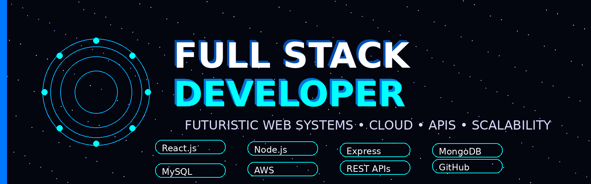

# <div align="center">


</div>

---

<div align="center">



</div>

---

## 🚀 About Me

```python
class AkashGupta:

    def __init__(self):
        self.role = "Web Developer"
        self.education = "B.Tech CSE Graduate"
        self.location = "India 🇮🇳"

        self.skills = [
            "HTML5",
            "CSS3",
            "WordPress",
            "Elementor",
            "SQL",
            "Microsoft Excel",
            "Git",
            "GitHub",
            "Web Hosting"
        ]

    def current_goal(self):
        return "Build Professional Websites & Grow as a Web Developer"

me = AkashGupta()
```


## 🎯 Current Focus

* 🌐 Building Responsive Websites
* ⚙️ Developing WordPress Solutions
* 🎨 Creating Modern UI Designs
* 🗄️ Working with SQL Databases
* 📊 Utilizing Microsoft Excel for Data Management
* 🔧 Strengthening Problem-Solving Skills

---

## 📈 Progress Tracker

🟩 HTML5 & CSS3       ██████████ 95%

🟩 WordPress          █████████░ 90%

🟩 Elementor          █████████░ 90%

🟩 SQL                ████████░░ 80%

🟩 Microsoft Excel    ████████░░ 80%

🟩 Git & GitHub       ████████░░ 80%

---

## 🌟 Motto

> "Transforming Ideas into Digital Solutions."

---

# 🌐 Connect With Me

<div align="center">

<a href="https://www.linkedin.com/in/akash-gupta17/">

</a>

</div>

---

# 💻 Languages

<div align="center">


</div>

---

# ⚡ Web Development Stack

<div align="center">


</div>

---

# 🛠️ Tools & Technologies

<div align="center">


</div>

### 💡 Additional Skills

* 🌐 WordPress Development
* 🎨 Elementor Page Builder
* 🗄️ SQL Database Management
* 📊 Microsoft Excel
* ☁️ Web Hosting & Deployment
* 🌐 Networking Fundamentals
* 🔧 DHCP & IP Addressing
* 📡 Routers & Switches
* 🖧 OSI & TCP/IP Models

---

# 📂 Featured Projects

### 🧠 Mental Health Support Group

A web platform that allows users to assess mental health, participate in discussions, and connect with support groups.

### 🚔 Crime Portal

A complaint registration platform for reporting cybercrime, social issues, and criminal activities.

### 💪 APEXELITE Gym Website

A responsive gym website featuring membership plans, personal training services, and modern UI design.

---

# 🔥 Daily Streak

<div align="center">


</div>

---


---

# 📊 Contribution Graph

<div align="center">


</div>

---

# 📈 GitHub Stats

<div align="center">


</div>

---

# ⚡ Current Mission

```python
while True:

    Build_Websites()

    Customize_WordPress()

    Learn_New_Technologies()

    Improve_Skills()

    Deploy_Web_Projects()

    Repeat()
```

---

<div align="center">

## 🚀 Web Developer

### ⚡ Design • Develop • Deploy

</div>

---

# 👀 Profile Visitors

<div align="center">


</div>
